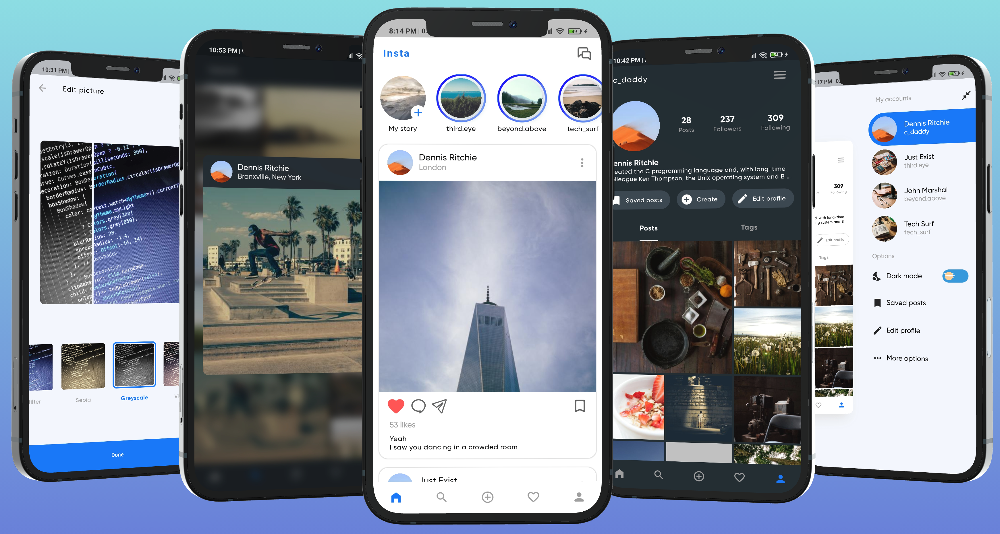

# Insta
> UI clone of Instagram app with few modifications

## Built with
 [Flutter](https://github.com/flutter/flutter)

## Screenshots

## Features
* Dark mode
* Story editing
* Awesome animations
* Create and add your own custom filters
* And many more

## Acknowledgements
* Designed by [Kirtanya Kardum](https://github.com/kirtanya)
* Created by [Somesh Mishra](https://github.com/somesh37)
